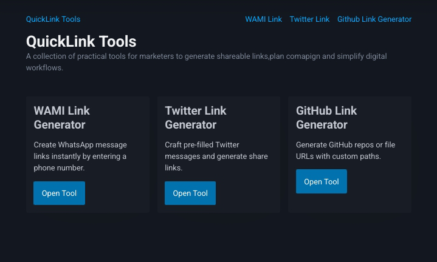

# 🔗 QuickLink Tools – The Link Generator

**QuickLink Tools** is a micro web tool that lets you generate shareable links for:

- 💬 **WhatsApp** (with pre-filled messages)  
- 🐦 **Twitter** (pre-filled tweets)  
- 🧑‍💻 **GitHub** (profile links)

---

## ✨ Why QuickLink Tools?

✅ **No sign-up needed**  
✅ **One-click copy**  
✅ **Made with pure HTML, CSS & JavaScript**  

Whether you're building a campaign, sharing your contact, or linking your GitHub profile — **QuickLink Tools does it all in one place.**

---

## 🚀 Live Demo

👉 [Try QuickLink Tools Now](https://quicklink-tools.vercel.app/)

---

## 🖼️ Preview

> 

---

## 🛠️ Built With

- ⚙️ **HTML5** – Semantic and accessible structure  
- 🎨 **CSS** – Clean, responsive styling  
- 🧠 **JavaScript** – Core logic for dynamic link generation  

No libraries. No frameworks. Just pure web development.

---

## 🧑‍💻 How to Use

1. Choose the platform (WhatsApp, Twitter, or GitHub).
2. Fill in the required info (e.g., message, username).
3. Click **Generate** to get your shareable link.
4. Hit **Copy** and you're done!

---
